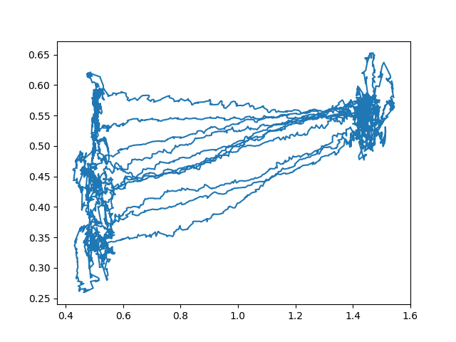

Data v grafu:
 
 

 
Popravde nevim, jak z toho mam neco urcovat.
bat_level je kompletne useless, chyba v dronu nebo ve firmwaru.
bat_voltage mi moc uzitecne take neni, protoze mam urcovat spotrebu baterie.
x,y,z jsou pozice drunu od pocatku, ale vzhledem k tomu, ze dron se otaci na miste po metru
(nemam tolik prostoru doma), tak se uletena vzdalenost take bude urcovat spatne, protoze vetsinu casu stal na miste.
 
 
Zavislost uletene vzdalenosti na baterii
 

 
 
a tady jeste zobrazena trasa ve 2d ze shora
 

