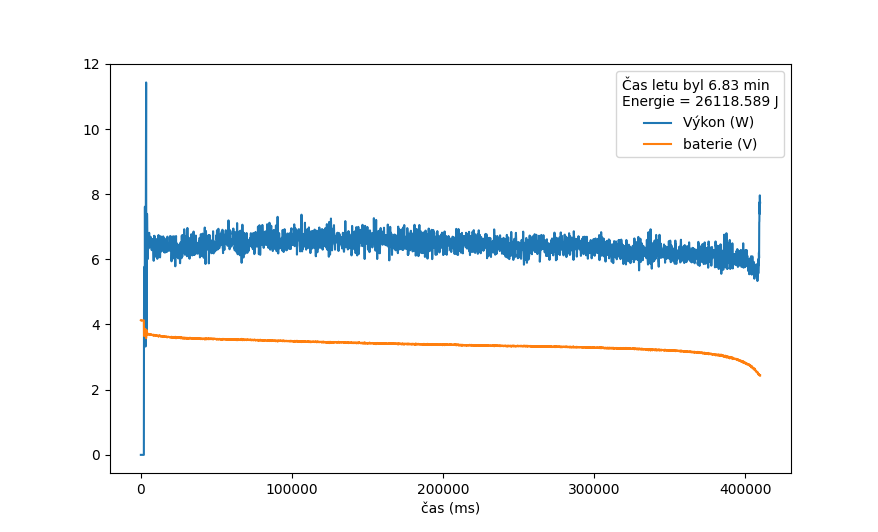
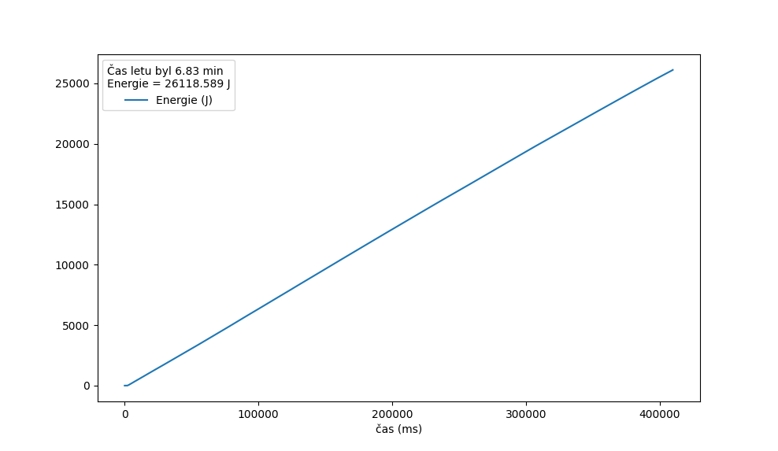
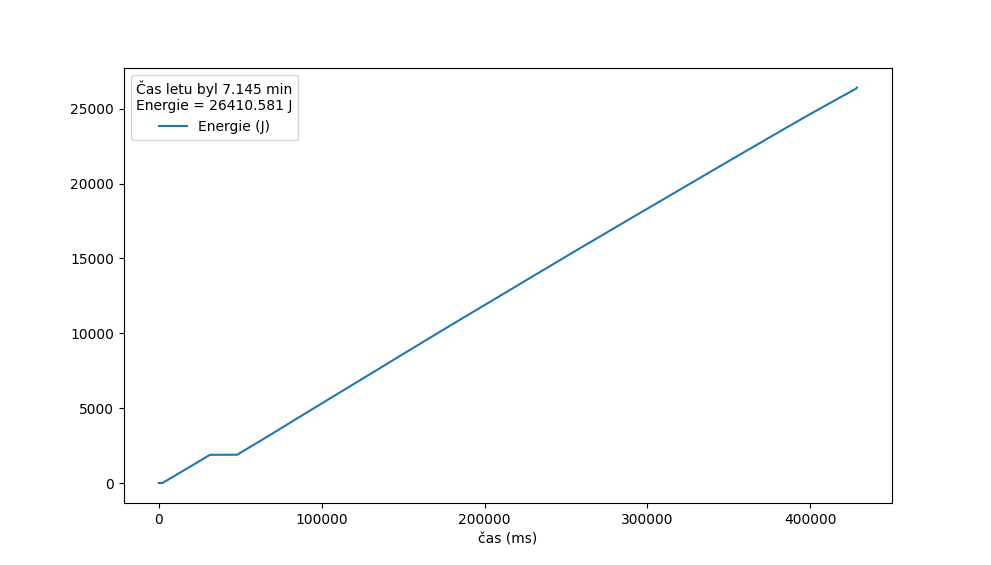
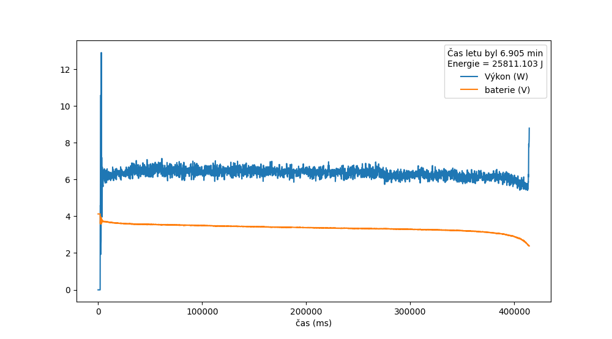
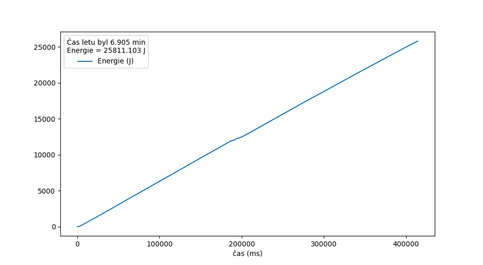
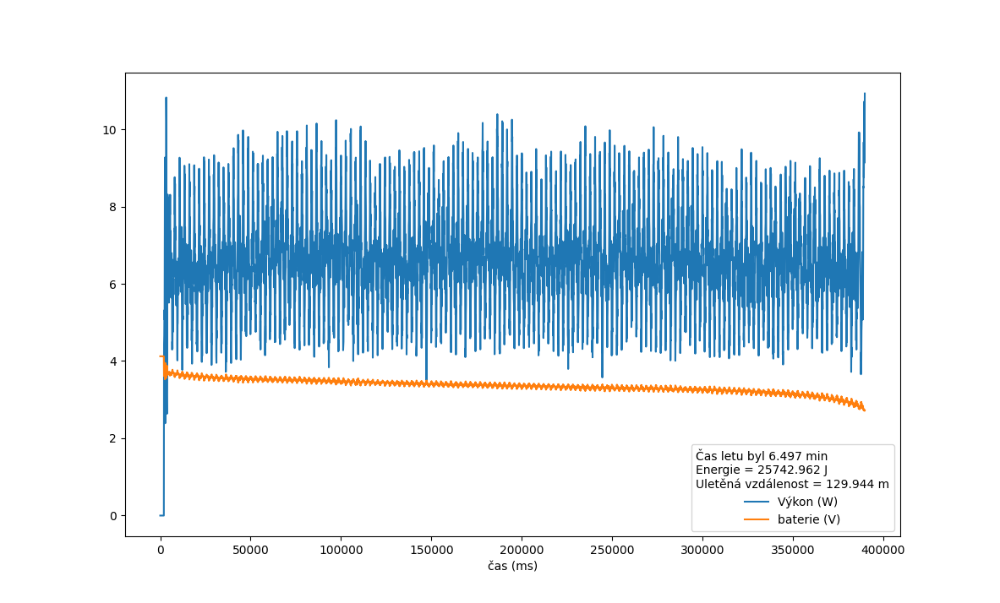
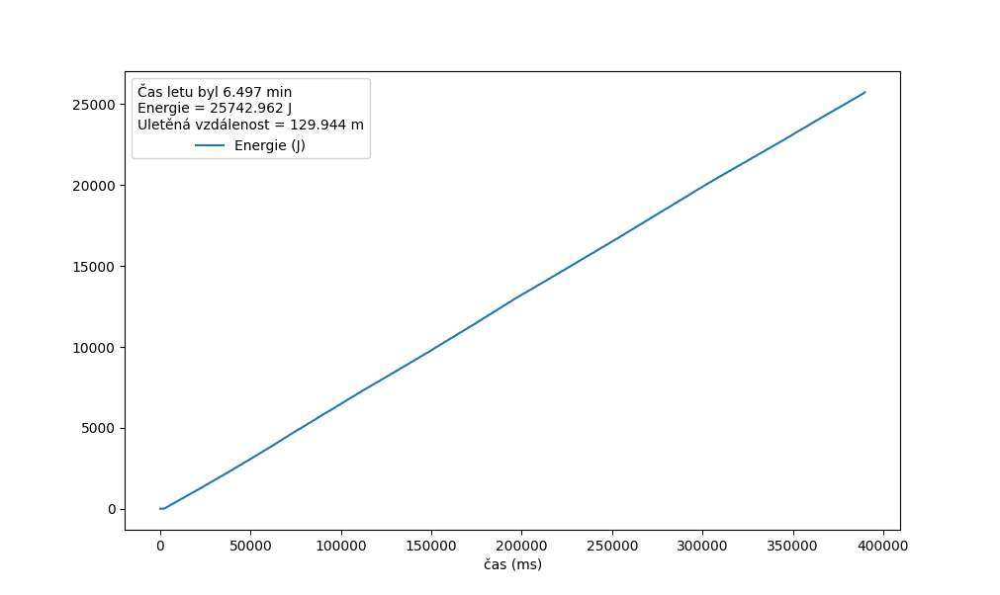
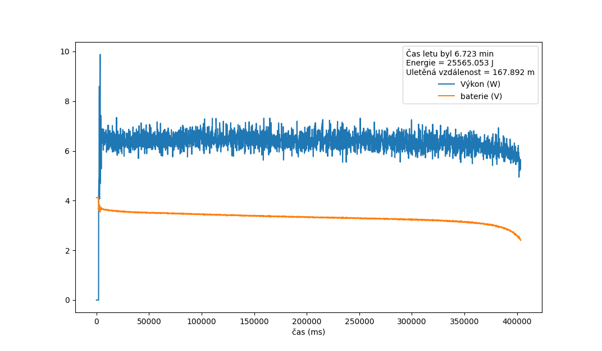
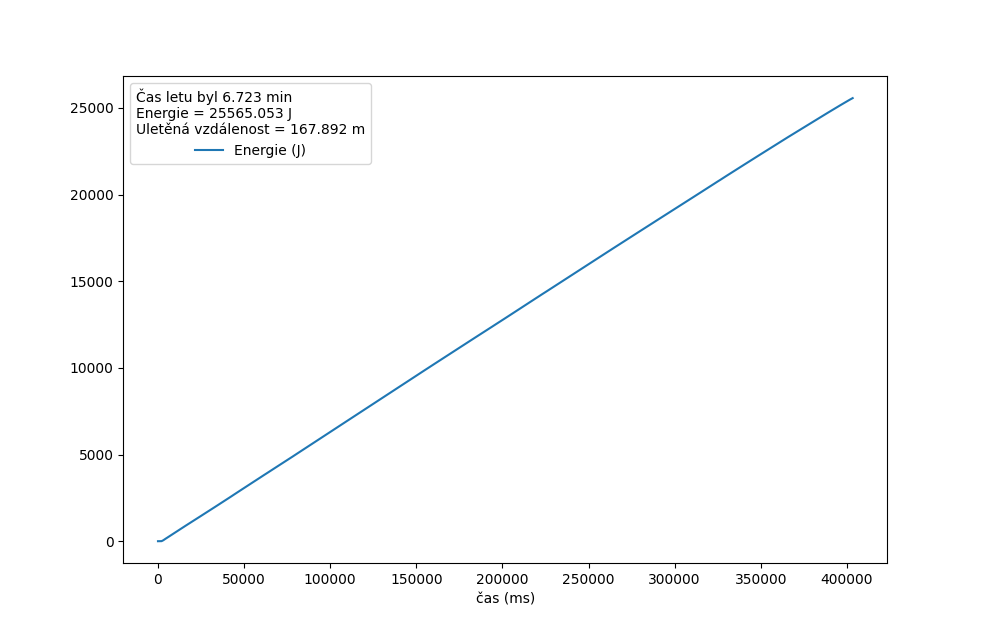

# Data
## Vznasejici se nad mistem
- Mechanicka energie + baterie a pod tim je suma mechanicke energie

## Nahoru a dolu po pul metru
- rychlost: 0.4 m/s

## Dopredu 1.5 m a zpatky
- Rychlost: 0.5 m/s

