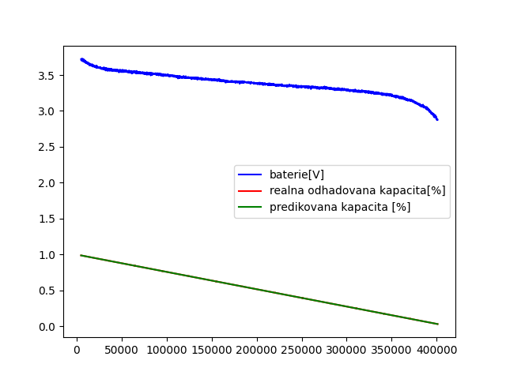
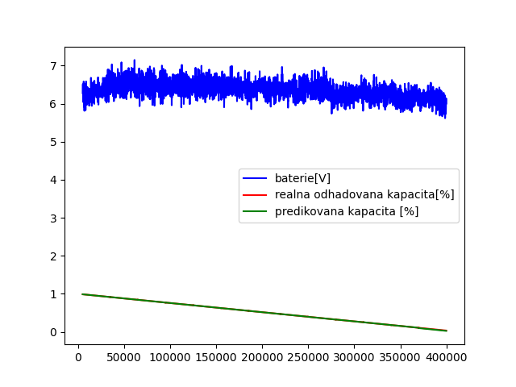
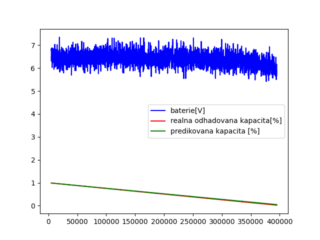

# Data
## Vznasejici se nad mistem
- Mechanicka energie + baterie

## Nahoru a dolu po pul metru
- rychlost: 0.4 m/s

## Dopredu 1.5 m a zpatky
- Rychlost: 0.5 m/s

## Predikce dat
### Predikce poklesu kapacity na napeti na baterii
- Evaluace na trenovacich datech

- Evaluace na testovacich datech

### Predikce poklesu kapacity na vykonu
***label "baterie[V]" je spatne, ma tam byt "vykon[W]"***
- Evaluace na trenovacich datech

- Evaluace na testovacich datech

